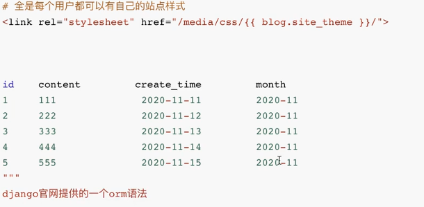

# 项目设计流程

------

```python
"""
1.项目需求分析
	架构师+产品经理+开发组组长：谈需求
	在客户需求前先了解需求，然后自己先设计一套
	再在沟通交流中往之前的方案靠
	形成一个初步方案
	
2.项目设计
	架构师：
		编程语言的选择
		选择框架
		数据库的选择
			主库：mysql、postgreSQL
			缓存数据库：redis。mongodb、memcacha...
		功能划分：
			将整个项目划分
		组长开会：
			分发任务
		项目报价
			技术预算：人力，时间（有的公司一个程序员一天1500-2000元）
			产品经理公司层面：
				公司财务确定
				公司老板确定
		产品经理跟客户沟通
		
		后续增加功能：加强
3.分组开发
	组长找组员开会，安排各自的功能
	我们就是在架构师设计好的框架里面填写代码而已
	
	我们在写代码的时候，写完要自己测试一下是否有bug
	如果是一些非常简单的bug，你没有发现被测试发现了
	你的绩效可能要被扣绩效了（要和测试搞好关系）
	
	为了避税
	薪资组成：15k
		底薪：10k
		绩效：3k
		岗位津贴：1k
		生活补贴：1k

4.测试
	测试部门测试
		压力测试
		、、、、、

5.交付上线
	1.交付对方的运维人员
	2.直接上线的我们的服务器上，收取维护费用
	3.其他

"""


```


# 表设计

------

```python
"""
一个项目中最重要的不是业务逻辑的书写
而是前期的表设计，只要将表设计设计好了，后续的功能书写才会好


表设计：
  1.用户表
   继承AbstaractUser
   扩展：
   	phone:手机号
   	avatar:头像
   	create_time:创建时间
   
   外键字段:
    一对一个人站点表
   
   
  
  2.个人站点表
   site_name:站点名称
   site_title:站点标题
   site_theme:站点样式
  	
  3.文章标签表
   name:标签民
   
   外键字段
   	一对多个人站点
   
  4.文章分类表
   name:分类名
   
   外键字段
    一对多个人站点
  
  5.文章表
   title:文章标题
   desc:文章简介
   content:文章内容
   create_time:发布时间
   
   数据库设计优化(虽然下面三个字段可以通过跨表查询计算出来,但是频繁的跨表效率低)
   up_num:点赞数
   down_num:点擦数
   comment_num:评论数
   
   外键字段:
    一对多个人站点:一个站点可以有多个文章
    多对多文章标签:每个文章可以有多个文章标签,每个标签可以有多个文章
    一对多文章分类：一个文章只能有一个分类，但是一个分类可以有多个文章
   
  6.点赞点擦表
   用来记录那个用户给那个用户点了赞还是点了踩
   user:用户          ForeignKey(to="User")
   article:文章       ForeignKey(to="Article")
   is_up:是否点赞      BooleanField()
   
  
   
   
  7.文章评论表
   用来记录那个用户给那个文章写了那些评论内容
   user:用户                 ForeignKey(to="User")
   article:文章              ForeignKey(to="Article")
   content:评论内容           CharField()
   comment_time:评论时间      DateField()
   # 自关联
   parent                    ForeignKey(to="Comment",null=True)
   # ORM专门提供的自关联写法    
   parent                    ForeignKey(to="self",null=True)

	
""" 
```


## 数据库表的创建和同步

```python
"""
由于django自带的数据库对时间不敏感，所以改成mysql

import pymysql
pymysql.install_as_MySQLdb()
"""
```


## 验证码相关模块

```python
"""
pip3 install pillow

# 使用
from PIL import Image,ImageDraw,ImageFont

Image：生成图片
ImageDraw：能够在图片上绘制
ImageFont：能够控制字体样式
	
    # img_obj = Image.new("RGB", (480, 35), "red")  # 调色模式，大小，颜色英文或（123,123,123）
    img_obj = Image.new("RGB", (480, 35), get_random_rgb())  # 调色模式，大小，颜色英文或（123,123,123）


内存管理器模块
from io import BytesIO,StringIO
BytesIO: 临时帮你存储数据，返回二进制
StringIO：临时帮你存储数据，返回字符串


字体网站：http://www.zhaozi.cn/ai/2019/fontlist.php?ph=1&classid=32&softsq=%E5%85%8D%E8%B4%B9%E5%95%86%E7%94%A8
"""
```

## 登录模块

```python
"""
        $.post({
            url: "",
            data: {
                "username": $("#username").val(),
                "password": $("#password").val(),
                "id_code": $("#id_code").val(),
                "csrfmiddlewaretoken": '{{ csrf_token }}'
,
            },
            success: function (args) {
                if (args.code === 200) {
                    //跳转
                    window.local.href = args.url;
                } else {
                    $("#span_error").text(args.msg)
                }
            }
        })
    })
    
    
   def login(requests):
    """
    登录验证模块
    :param requests:
    :return:
    """
    if requests.method == "POST":
        back_dic = {"code": 200, "msg": ""}
        username = requests.POST.get("username")
        password = requests.POST.get("password")
        id_code = requests.POST.get("id_code")
        if requests.session.get("code").upper() == id_code.upper():
            # 校验账号密码是否正确
            user_obj = auth.authenticate(requests=requests, username=username, passowrd=password)
            if user_obj:
                # 保存用户状态
                auth.login(requests, user_obj)
                back_dic["url"] = "/home/"
            else:
                back_dic["code"] = 402
                back_dic["msg"] = "用户名或者密码错误"
        else:
            back_dic["code"] = 403
            back_dic["msg"] = "验证码错误"
        return JsonResponse(back_dic)
    return render(requests, "app01/login.html")

"""
```

## admin后台管理

```python
"""
django提供一个可视化的界面用来让你方面的管理模型表，
进行增删查改


如果你要使用的话要去注册
去admin。py下去注册

注册一个

admin.site.register(models.UserInfo)
admin.site.register(models.UpAndDown)
admin.site.register(models.Tag)
admin.site.register(models.AbstractUser)
admin.site.register(models.Article)
admin.site.register(models.Article2Tag)
admin.site.register(models.Blog)
admin.site.register(models.Category)
admin.site.register(models.Comment)

admin会给每个注册了的模型表自动生成增删查改4条url


如果你不想要英文名可以改成中文
在models中添加meta

class UserInfo(AbstractUser):
    phone = models.BigIntegerField(verbose_name="手机号", null=True)

    # 头像
    avatar = models.FileField(upload_to="avatar/", default="avatar/default.png", verbose_name="用户头像")
    # 设置文件保存地址，如果没有就设置默认头像

    create_time = models.DateField(auto_now_add=True)

    blog = models.OneToOneField(to="Blog", null=True, on_delete=models.CASCADE)

    class Meta:
        verbose_name_plural="用户表"


1.在数据绑定的时候要注意用户的关系不要搞好哦

2.标签
 
3. 标签和文章

"""
```

## 用户头像展示

```python
"""
1.网站所使用的静态文件默认放在static文件夹下
2.用户上传的静态文件应该也要放到一个文件夹下

media配置
	该配置可以让用户上传的所有文件都固定存放在某一个指定的文件夹下
	strings中配置
# 配置用户上传文件位置
MEDIA_ROOT = os.path.join(BASE_DIR,"media")
配置会创建多级目录

开设后端资源

1.urls中书写代码
    re_path(r'media/(?P<path>.*)$', serve, {'document_root': settings.MEDIA_ROOT}),

"""
```

## 图片防盗链

```python
# 如何避免别的网站直接通过本网站的url访问本网站资源

# 简单的防盗
	我们可以做到请求来的时候先看看他当前的请求是从那个网站过来的
    如果是自己网站正常访问
    如果是其他拒接
    	请求头中有一个专门记录请求来自那个网站的
        referer
# 避免
1.直接修改href
2.爬虫直接吧所有的东西下载下来
 
```

## 个人站点

```python
"""
# 1.查询当前用户所有的分类及分类小的文章数
category_list = models.Category.objects.filter(blog=blog).annotate(
    count_name=Count("article__pk")
).values("name", "count_name")
print(category_list)
"""
    # 2.差早当前用户所有的标签和标签数
    tag_list = models.Tag.objects.filter(blog=blog).annotate(
        count_name=Count("article__pk")
    ).values("name", "count_name")


# 独立的样式
    <link rel="stylesheet" href="/media/css/{{ blog.site_theme }}">

```



```python
from django.db.models.functions import TruncMonth

data_list =models.Article.objects.filter(blog=blog)# 查询出指定的文章
    .annotate(month=TruncMonth("create_time")) # 按照年月处理数据再数据中加入month字段
    .values("month") # 根据年月分组
    .annotate(count_num=Count("pk")) # 分组统计pk
    .values("month", "count_num") # 取出数据

```


## 文章详情

```python
# url设置
/username/article/1

# 先验证url是否会冲突

# 文章详情页和个人站点基本一致，所以用模板继承

# 侧边栏的渲染需要传输数据才能渲染，并且很多页面都要
	1.那个地方用就拷贝代码（简单不推荐，繁琐）
    
    2.制作成inclusion_tag
 # inclusion_tag 步骤
 """
 1.在应用小创建一个名字必须叫templatetags文件夹
 2. 在该文件夹内创建一个任意名称的py文件
 3. 在该oy文件内先固定写两行代码
 	form django import template
 	register = template.Library()
 	自定义过滤器
 	自定义标签
 	自定义inclusion_tag
 	
	
 """
```


文章点赞点踩

```python
"""
浏览器上你看到的花里胡哨的页面都是html


点赞点擦图表
拷贝html
拷贝css


判断点赞和点擦
1.给标签各自绑定一个事件
 两个标签对应的代码其实基本一样但是只是一个参数不一致
2.合在一起
            if ($(this).hasClass("diggit")){
由于点赞点擦内部逻辑较多，单独开设 

def up_or_down(requests):
    """
    1.校验登录
    2. 自己不能给自己点
    3。只能点一次
    4.操作数据库
    点赞点擦的处理
    :param requests:
    :return:
    """
    if requests.is_ajax():
        back_dict = {"code": 200, "msg": ""}

        # 判断是否登录
        if requests.user.is_authenticated:
            article_id = requests.POST.get("article_id")
            is_up = json.loads(requests.POST.get("is_up"))

            # 判断是否是自己写的
            article_obj = models.Article.objects.filter(pk=article_id).first()

            if not article_obj.blog.userinfo == requests.user:
                # 校验用户是否已经点过
                is_click = models.UpAndDown.objects.filter(user=requests.user, article=article_obj)

                if not is_click:
                    # 操作数据库 ,要同步操作
                    # 判断是点赞还是点擦

                    if is_up:
                        # 给点赞增加一
                        models.Article.objects.filter(pk=article_id).update(up_num=F("up_num") + 1)
                        back_dict["msg"] = "点赞成功"
                        pass
                    else:
                        # 给点擦加一
                        models.Article.objects.filter(pk=article_id).update(down_num=F("down_num") + 1)
                        back_dict["msg"] = "点踩成功"
                    # 操作表
                    models.UpAndDown.objects.create(user=requests.user, article=article_obj, is_up=is_up)
                else:
                    # 校验用户是否已经点过
                    back_dict["code"] = 2001
                    back_dict["msg"] = "你已经点过l"
            else:
                # 判断是否是自己写的
                back_dict["code"] = 2002
                back_dict["msg"] = "不可以点自己"
        else:
            # 判断是否登录
            back_dict["code"] = 2003
            back_dict["msg"] = '<a href="/login/">要登录哦</a>'
        return JsonResponse(back_dict)


    <script>

        $(".action").click(function () {
            {#将点击保存起来#}
            let isUP = $(this).hasClass("diggit")
            let $div = $(this)
            {#发送请求#}
            $.post({
                url: "",
                data: {
                    "article_id": "{{ article_obj.pk }}",
                    "is_up": isUP,
                    "csrfmiddlewaretoken": '{{ csrf_token }}'
                },
                success: function (args) {
                    let digg = $("#digg_tips")
                    if (args.code === 200) {
                        // 将数据加一
                        //先获得之前的
                        let oldNum = $div.children().text() // 是字符串类型
                        $div.children().text(Number(oldNum) +1 ) //要转换以后才可以增加
                        digg.text(args.msg)
                    } else {
                        digg.html(args.msg)
                    }
                },
            });
        })

    </script>


"""
```

## 文章评论

```python
点击按钮将评论框里面的内容清空
# 根评论两种渲染方式
1.DOM渲染
2.页面刷新render渲染

"""
子评论
 点击回复按钮发送了几件事
 1. 评论框自动聚集
 2。将回复按钮所在的那一行评论人的姓名
3。评论框内部自动换行

根评论和子评论的区别在哪里
id
"""
```

## 文章管理

``` python
 """
 所有的文件夹内部都可以根据功能的细化，再细化文件夹
 分页
 1.创建文件夹utils
 2.创建任意文件
 3.写入之前的class自定义分页器
 	# -*- coding: utf-8 -*-
# All Rights Reserved 
# @Time    : 2022/11/1114:53
# @Author  : Small Fu
# @Email   : 2737454073@qq.com
# @File    : app01_page.py
__author__ = 'Small Fu'


class Pagination(object):
    def __init__(self, current_page, all_count, per_page_num=2, pager_count=11):
        """
        封装分页相关数据
        :param current_page: 当前页
        :param all_count:    数据库中的数据总条数
        :param per_page_num: 每页显示的数据条数
        :param pager_count:  最多显示的页码个数
        """
        try:
            current_page = int(current_page)
        except Exception as e:
            current_page = 1

        if current_page < 1:
            current_page = 1

        self.current_page = current_page

        self.all_count = all_count
        self.per_page_num = per_page_num

        # 总页码
        all_pager, tmp = divmod(all_count, per_page_num)
        if tmp:
            all_pager += 1
        self.all_pager = all_pager

        self.pager_count = pager_count
        self.pager_count_half = int((pager_count - 1) / 2)

    @property
    def start(self):
        return (self.current_page - 1) * self.per_page_num

    @property
    def end(self):
        return self.current_page * self.per_page_num

    def page_html(self):
        # 如果总页码 < 11个：
        if self.all_pager <= self.pager_count:
            pager_start = 1
            pager_end = self.all_pager + 1
        # 总页码  > 11
        else:
            # 当前页如果<=页面上最多显示11/2个页码
            if self.current_page <= self.pager_count_half:
                pager_start = 1
                pager_end = self.pager_count + 1

            # 当前页大于5
            else:
                # 页码翻到最后
                if (self.current_page + self.pager_count_half) > self.all_pager:
                    pager_end = self.all_pager + 1
                    pager_start = self.all_pager - self.pager_count + 1
                else:
                    pager_start = self.current_page - self.pager_count_half
                    pager_end = self.current_page + self.pager_count_half + 1

        page_html_list = []
        # 添加前面的nav和ul标签
        page_html_list.append('''
	                    <nav aria-label='Page navigation>'
	                    <ul class='pagination'>
	                ''')
        first_page = '<li><a href="?page=%s">首页</a></li>' % (1)
        page_html_list.append(first_page)

        if self.current_page <= 1:
            prev_page = '<li class="disabled"><a href="#">上一页</a></li>'
        else:
            prev_page = '<li><a href="?page=%s">上一页</a></li>' % (self.current_page - 1,)

        page_html_list.append(prev_page)

        for i in range(pager_start, pager_end):
            if i == self.current_page:
                temp = '<li class="active"><a href="?page=%s">%s</a></li>' % (i, i,)
            else:
                temp = '<li><a href="?page=%s">%s</a></li>' % (i, i,)
            page_html_list.append(temp)

        if self.current_page >= self.all_pager:
            next_page = '<li class="disabled"><a href="#">下一页</a></li>'
        else:
            next_page = '<li><a href="?page=%s">下一页</a></li>' % (self.current_page + 1,)
        page_html_list.append(next_page)

        last_page = '<li><a href="?page=%s">尾页</a></li>' % (self.all_pager,)
        page_html_list.append(last_page)
        # 尾部添加标签
        page_html_list.append('''
	                                           </nav>
	                                           </ul>
	                                       ''')

        return ''.join(page_html_list)

 4.使用
     article_list = models.Article.objects.filter(blog=requests.user.blog)
    # 分页
    page_obj = Pagination(
        current_page=requests.GET.get("page", 1),
        all_count=article_list.count(),
        per_page_num=20,
    )
    page_queryset = article_list[page_obj.start:page_obj.end]

    return render(requests, "app01/app10_backend/backend.html", locals())
 """
```

# 富文本编辑器

```python
# kindeditor富文本编辑器
       <div>
            <textarea name="content" id="id_content" cols="30" rows="10"></textarea>
        </div>

        
            <script charset="utf-8" src=""></script>
    <script charset="utf-8" src=""></script>
    <script>
        KindEditor.ready(function (K) {
            window.editor = K.create('#id_content',
                {
                    width: '100%',
                    height: "400px",
                    resizeType: 1,
                }
            );
        });
```

### 编辑器使用方法

### 1. 下载编辑器

下载 KindEditor 最新版本，下载之后打开 examples/index.html 就可以看到演示。

下载页面: http://www.kindsoft.net/down.php

### 2. 部署编辑器

解压 kindeditor-x.x.x.zip 文件，将所有文件上传到您的网站程序目录里，例如：[http:/](http://kindeditor.net/)/您的域名/editor/

Note

您可以根据需求删除以下目录后上传到服务器。

- asp - ASP程序
- asp.net - ASP.NET程序
- php - PHP程序
- jsp - JSP程序
- examples - 演示文件

### 3. 修改HTML页面

1. 在需要显示编辑器的位置添加textarea输入框。

```
<textarea id="editor_id" name="content" style="width:700px;height:300px;">
&lt;strong&gt;HTML内容&lt;/strong&gt;
</textarea>
```

Note

- id在当前页面必须是唯一的值。
- 在textarea里设置HTML内容即可实现编辑，在这里需要注意的是，如果从服务器端程序(ASP、PHP、ASP.NET等)直接显示内容，则必须转换HTML特殊字符(>,<,&,”)。具体请参考各语言目录下面的demo.xxx程序，目前支持ASP、ASP.NET、PHP、JSP。
- 在有些浏览器上不设宽度和高度可能显示有问题，所以最好设一下宽度和高度。宽度和高度可用inline样式设置，也可用 [编辑器初始化参数](http://kindeditor.net/docs/option.html) 设置。

1. 在该HTML页面添加以下脚本。

```
<script charset="utf-8" src="/editor/kindeditor.js"></script>
<script charset="utf-8" src="/editor/lang/zh-CN.js"></script>
<script>
        KindEditor.ready(function(K) {
                window.editor = K.create('#editor_id');
        });
</script>
```

Note

- 第一个参数可用其它CSS选择器，匹配多个textarea时只在第一个元素上加载编辑器。
- 通过K.create函数的第二个参数，可以对编辑器进行配置，具体参数请参考 [编辑器初始化参数](http://kindeditor.net/docs/option.html) 。

```
var options = {
        cssPath : '/css/index.css',
        filterMode : true
};
var editor = K.create('textarea[name="content"]', options);
```

### 4. 获取HTML数据

```
// 取得HTML内容
html = editor.html();

// 同步数据后可以直接取得textarea的value
editor.sync();
html = document.getElementById('editor_id').value; // 原生API
html = K('#editor_id').val(); // KindEditor Node API
html = $('#editor_id').val(); // jQuery

// 设置HTML内容
editor.html('HTML内容');
```

Note

- KindEditor的可视化操作在新创建的iframe上执行，代码模式下的textarea框也是新创建的，所以最后提交前需要执行 [sync()](http://kindeditor.net/docs/editor.html#keditor-sync) 将HTML数据设置到原来的textarea。
- KindEditor在默认情况下自动寻找textarea所属的form元素，找到form后onsubmit事件里添加sync函数，所以用form方式提交数据，不需要手动执行sync()函数。
- KindEditor默认采用白名单过滤方式，可用 [htmlTags](http://kindeditor.net/docs/option.html#htmltags) 参数定义要保留的标签和属性。当然也可以用 [filterMode](http://kindeditor.net/docs/option.html#filtermode) 参数关闭过滤模式，保留所有标签。

```
// 关闭过滤模式，保留所有标签
KindEditor.options.filterMode = false;

KindEditor.ready(function(K)) {
        K.create('#editor_id');
}
```

## 添加文章

```python
"""
有两个要注意的问题
1、 文章简介
	不能直接切去
	应该想办法获取到当前页面的文本内容，然后再截取150个文本
2.xss攻击，跨站脚本攻击
	正针对支持用户编写的html代码网址
	针对用户书写的内容
	 1.注释标签内部的内容	
	 2.直接将scripy删除
	 
解决 
	1.通过正则表达式筛
	2.直接确定获取

beauitfulsoup  bs4
	处理html页面
	        # 模块使用
        soup = BeautifulSoup(content,"html.parser")
        # 获取所有的标签
        tags = soup.find_all()

        # 处理标签
        for tag in tags:
            if tag.name == "script":
                # 是就删除
                tag.decompose()
        # 文章简介
        # 暴力截取所有
        # desc = content[:150]
        # 2.获得全部文本再截取
        desc = soup.text[:150]

        article_obj = models.Article.objects.create(
            title=title,
            content=str(soup),
            desc=desc,
            category_id=category_id,
            blog=requests.user.blog
        )

"""
```


## 编辑器上传图片

```python
别人写好了接口但是接口不是自己的，你要手动修改
出现方法错误，看官方文档
    back_dict = {
        "error": 0,
        # "url":"static/app01/img/default.png"
    }  # 提前定义数据格式
    if requests.method == "POST":
        # 获取用户上传的图片数据
        file_obj = requests.FILES.get("imgFile")
        # 手动拼接存储路径
        file_dir = os.path.join(settings.BASE_DIR, "media", "article_img")
        # 优化操作
        # 判断是否存在不存在创建
        if not os.path.isdir(file_dir):
            os.mkdir(file_dir)
        # 做图片名称处理
        img_file = "_".join( (str(requests.user.pk), str(int(time.time())), file_obj.name))
        # 拼接图片完整路径
        file_path = os.path.join(file_dir,img_file)
        with open(file_path,"wb") as f:
            for line in file_obj:
                f.write(line)

        back_dict["url"] = f"media/article_img/{img_file}"

        
                KindEditor.ready(function (K) {
            window.editor = K.create('#id_content',
                {
                    width: '100%',
                    height: "400px",
                    resizeType: 1,
                    uploadJson: '', //上传图片后端的位置
                    extraFileUploadParams: {
                        //支持上传文件携带参数
                        "csrfmiddlewaretoken": "{{ csrf_token }}"
                    }
                }
            );
        });
            
注意要在setings中添加配置不然会报错
X_FRAME_OPTIONS = 'ALLOWALL'

```


## 修改用户头像

```python
    if requests.method == "POST":
        img_file_obj = requests.FILES.get("avatar")
        # 这个不会写到数据库中文件只会是文件名，没有路径
        # models.UserInfo.objects.filter(pk=requests.user.pk).update(avatar=img_file_obj)
        # 解决办法
         # 1.自己拼接
        # 2.换一种更新
        user_obj = requests.user
        user_obj.avatar = img_file_obj
        user_obj.save()
        return redirect(reverse("home"))
```

# 总结

```python
# 在开发任意的web项目的时候，其实到了后期需要写的代码会越来越少
# 都是用已经写好的url到a标签中来实现
主要功能总结
 表设计，开发流程（粗糙进程，细化）
 表设计，
 注册功能
    	from表单使用
        头像动态显示
        错误信息提示
  登录功能
	图片验证码
    滑动验证码
  首页展示
	media配置
    主动暴露任意接口
   
  个人站点
    侧边栏展示
    侧边栏筛选
    侧边栏inclusion_tag
  文章详情页
    点赞点踩
    评论
  后台管理
"""
针对项目，要掌握书写思路，内部逻辑
"""
```

